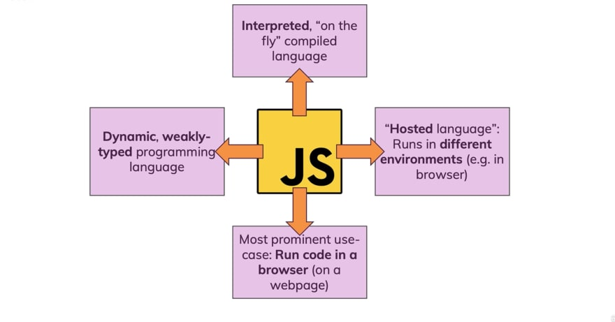

# JavaScript ဆိုတာဘာလဲ??


## History of JavaScript


        JavaScript ကို  1995 ခုနှစ်တွင် Brendan Eichက 
 
Mocha နာမည်ဖြင့် တီထွင်ခဲ့ပါသည်" 

1995 မေလတွင် LiveScript ဟူသော အမည်ကို ပြောင်းခဲ့ပြီး 

1995 ဒီဇင်ဘာလတွင် JavaScript ဟူသော အမည်ကို 

ထပ်မံပြောင်းလဲခဲ့ပါသည်" ဈေးကွက်ရှာဖွေရန်နှင့် 

လူသိများစေရန် ရည်ရွယ်၍ ထိုအချိန်က အကျော်ကြားဆုံး 

languae ဖြစ်သည့် java ဧ အမည်ကိုယူ၍ JavaScript ဟူသော 

အမည်ကို ပြောင်းလဲခဲ့ခြင်းဖြစ်ကြောင်း လူအများက 

ယူဆကြသည်"""
         Microsoft သည် 1995 ခုနှစ်တွင် internet Exploer ကို ပွဲထုတ်ခဲ့ပြီး 

JavaScript နှင့် အပြိုင်ဖြစ်ခဲ့သည်"" Java Script ရှေ့တွင် Microsoft သည် 

JScript ဟုခေါ်သော reverse-engineered the Navigator 

ကိုပြုလုပ်ခဲ့သည်""


## What is JavaScript?  

  JavaScript သည် Scripting Language တစ်မျိုးဖြစ်သည်"" 

JavaScript သည် dynamic weakly typed  programming language 

တစ်မျိုးဖြစ်သည်"" 



JavaScript သည် webpage များဧ complex features များကို 

ဖြေရှင်းပေးသော programming language တစ်မျိုးဖြစ်သည်""

HTML, CSS နှင့် JavaScript တို့သည် World Wide Web ၏ 

အသုံးအများဆုံးသော အတွင်းအကျဆုံး  နည်းပညာများဖြစ်ပြီး Web 

Browser အားလုံးကလည်း support ပေးထားပါသည်""

JavaScript ကို web-based application နှင့် web browsers များတွင် 

အဓိက သုံကြသည်"

သို့ပေမယ့် Mobile Application, Game, Presentations Server 

Applications  နှင့် Web Serversတို့တွင်လဲ အသုံးပြုနိုင်ပါသသည်"

## Web Applications

Browsers များတွင် တစ်နေ့ထပ်တစ်နေ့ နေ့စဉ် တိုးတက်နေသောကြောင့် 

JavaScript သည် ကောင်းမွန်သော web Application များပြုလုပ်ရန် 
ကြိုးစားလာသည်"" ဥပမာ Google Maps တွင် user သည် 

လိုချင်သောနေရာကို click နှိပ် ယုံဖြင့် အသေးစိတ်အချက်အလက်များကို 

သိနိုင်ခြင်းမှာ JavaScript ကို အသုံးပြုထားခြင်းဖြစ်သည်""

## Web Development

  JavaScript ကို အဓိကအားဖြင့် web page များတွင် 

အသုံးပြုသည်""dynamic webpage နှင့် special effects webpage များကို 

javaScript ကိုအသုံးပြု၍ တည်ဆောက်နိုင်သည်"""ဥပမာ websites များတွင် 

validation ပြုလုပ်ခြင်းကို အသုံးပြုလေ့ရှိသည်"" JavaScript သည် 

ထိုရှုပ်ထွေးသော action များကို ဖြေရှင်းပေးပီး အသုံးပြုသူအား interaction 

ပြန်ပြပေးသည်။

## Mobile Application

ယနေ့ခေတ်တွင် လူတို့သည် smart phone များကို ကျယ်ကျယ်ပြန့်ပြန့် 

အသုံးပြုလာကြသည်။

JavaScriptဧ  framework တစ်ခုဖြစ်သော React Native ကို အသုံးပြု၍ 

Mobile Application များကို ဖန်တီးနိုင်ပါသည်။ React Native သည် iOS နှင့် 

Andriod အတွက် သက်သက်ခွဲရေးစရာမလိုဘဲ တစ်ကြိမ်သာရေး၍ 

မတူညီသော platform များတွင် run နိုင်ပါသည်။


## Games
Game များ ဖန်တီးရာတွင်လည်း JavaScript ကို အသုံးပြုနိုင်သည်။ 

Game တစ်ခု ဖန်တီးရန်အတွက် အမျိုးမျိုးသော libraries များနှင့် 

frameworks များရှိသည်။Gameသည် 2D သို့မဟုတ် 3D 

ဖြစ်နိုင်သည်။PhysicsJS, Pixi.js ကဲ့သို့သော JavaScript game engine 

အချို့ကိုweb Game များ ဖန်တီးရန် အတွက် အသုံးပြုနိုင်သည်။Browsers 

များတွင် 2D နှင့် 3D ရုပ်ပုံများကို ဖော်ပြရန်အတွက် JavaScript API 

ဖြစ်သည့် WebGL  (web graphics library) ကို အသုံးပြုနိုင်သည်။


## Presentations
JavaScript ကို website များတွင် presentation 

ပြုလုပ်ရန်အတွက်လည်း အသုံးပြုနိုင်သည်။ RevealJS နှင့် BespokeJs 

ကဲ့သို့သော libraries များကို web-based slide deck များ ပြုလုပ်ရန် 

အသုံးပြုနိုင်ပါသည်။၎င်းတို့သည် အသုံးပြုရပိုမိုလွယ်ကူသောကြောင့် 

ကျွန်တော်တို့သည် အချိန်တိုအတွင်း အံ့ဩဖွယ် presentations ကို 

အလွယ်တကူ ပြုလုပ်နိုင်မည်ဖြစ်သည်။Reveal.js ကို HTML အကူအညီဖြင့် 


interactive နှင့် လှပသော side decks များ ဖန်တီးရန် အသုံးပြုသည်။ထို 

presentationsများသည် mobile devices နှင့် tablets များတွင်လည်း 

အလုပ်လုပ်ပါသည်။၎င်းသည် CSS color formats များအားလုံးကိုလည်း 

support  ပေးထားပါသည်။ BespokeJS တွင် animated bullet lists, 

responsive scaling နှင့် a wide variety of  features တို့ ပါဝင်ပါသည်။

## Server Applications

Web Application အများအပြားတွင် server-side ရှိသည်။ JavaScript 

ကို generate content နှင့် handle HTTP requests  များတွင် 

အသုံးပြုသည်။ JavaScript သည် Node.ja မှတဆင့် server များတွင်လည်း 

လုပ်ဆောင်နိုင်သည်။

Node.js သည် serverများပေါ်တွင် လုပ်ဆောင်ရန် JavaScript အတွက် 

လိုအပ်သော tools များကို ပံ့ပိုးပေးသည်။

## Web Server 

Node.js ကို အသုံးပြု၍ web server များကို ပြုလုပ်နိုင်သည်။Node.js ကို 

အသုံးပြု၍ ပြုလုပ်ထားသော server များသည် မြန်ဆန်ပြီး buffering နှင့် 
data  အပိုင်းများ လွှဲပြောင်းခြင်းကို မပြုလုပ်ပါ။createServer() method ကို 

အသုံးပြု၍ server ဖန်တီးရန် HTTP module 

ကိုအသုံးပြုနိုင်သည်။တစ်စုံတစ်ယောက်သည် port 8080 ကိုဝင်ရောက်ရန် 

ကြိုးစားသောအခါ ဤmethod ကို လုပ်ဆောင်သည်။ တုံ့ပြန်မှုအနေဖြင့် 

HTTP server သည် HTML ကို ပြသသင့်ပြီး HTTP header တွင် 

ထည့်သွင်းသင့်သည်။


## How JavaScript executed?

Execution Context တွင် လက်ရှိလုပ်ဆောင်နေသော code နှငိ့ ၎င်း၏ 

လုပ်ဆောင်မှုတွင် အထောက်အကူပြုသည့် အရာအားလုံး 

ပါဝင်ပါသည်။Execution Context run-time အတွင်း သီးခြား code ကို 

parser  တစ်ခုမှ ခွဲခြမ်းစိတ်ဖြာပြီး variable များနှင့် functions များကို 

memory တွင် သိမ်းဆည်းထားကာ executable byte-code ထုတ်ပေးပြီး 

code ကို execute လုပ်ပါသည်။

## JavaScript ကို HTML နှင့် ချိတ်ဆက်နည်း

JavaScript ကို internal နှင့် external နည်းနှစ်မျိုးဖြင့် 

ဆက်သွယ်နိုင်သည်"" internal နည်းမှာ HTML document ထဲတွင် script 

Tag ကို အသုံးပြု၍ ဆက်သွယ်ခြင်းဖြစ်သည်""
External နည်းမှာ JavaScript file ကိုတည်ဆောက်ပီး HTML document 

တွင်

 <script scr=”javascriptfilename”> </script>ကို 

အသုံးပြု၍ ဆက်သွယ်ခြင်း ဖြစ်သည်""


## Example1

```javascript

<!DOCTYPE html>
<html lang="en">
<head>
    <meta charset="UTF-8">
    <meta http-equiv="X-UA-Compatible" content="IE=edge">
    <meta name="viewport" content="width=device-width, initial-scale=1.0">
    <title>Document</title>
</head>
<body>
    

    <script src="yourjavascript.js"></script>
</body>
</html>

```

## Example2

```javascript

<!DOCTYPE html>
<html lang="en">
<head>
    <meta charset="UTF-8">
    <meta http-equiv="X-UA-Compatible" content="IE=edge">
    <meta name="viewport" content="width=device-width, initial-scale=1.0">
    <title>Document</title>
    <Script src="yourjavascript.js"></Script>
</head>
<body>
    
</body>
</html>
```

## Example3

```javascript

<!DOCTYPE html>
<html lang="en">
<head>
    <meta charset="UTF-8">
    <meta http-equiv="X-UA-Compatible" content="IE=edge">
    <meta name="viewport" content="width=device-width, initial-scale=1.0">
    <title>Document</title>
    <Script>
        function myFunction() {
            alert("hello world")
        }
    </Script>
</head>
<body>
    
</body>
</html>
```

## Other Scripting Languages

Scripting languages များတွင် JavaScript နှင့် အခြားscripting 

languages များလည်းရှိသည်"" ၎င်းတို့မှာ PHP, Perl, Bash, PowerShell, 

Python, Ruby, VBA, GML အစရှိသဖြင့် အများအပြားရှိပါသည်"""

